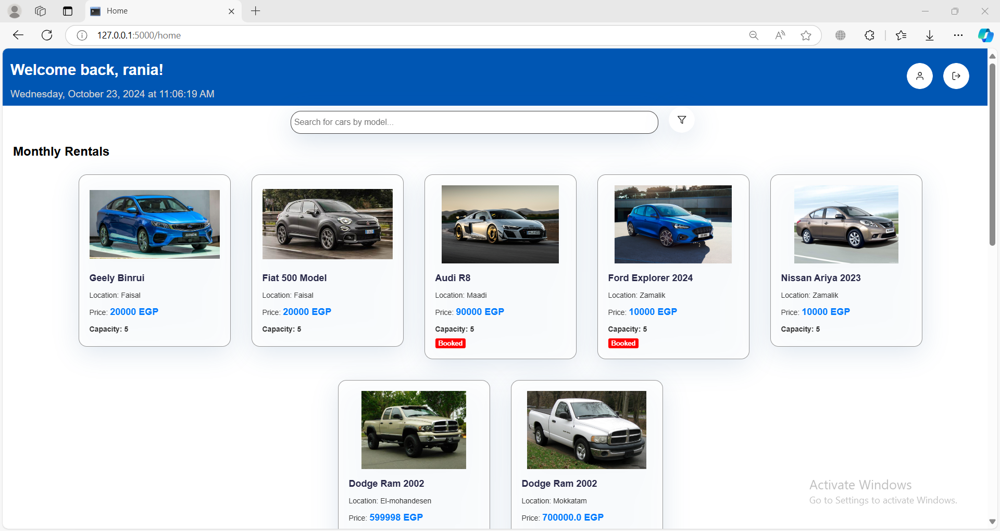
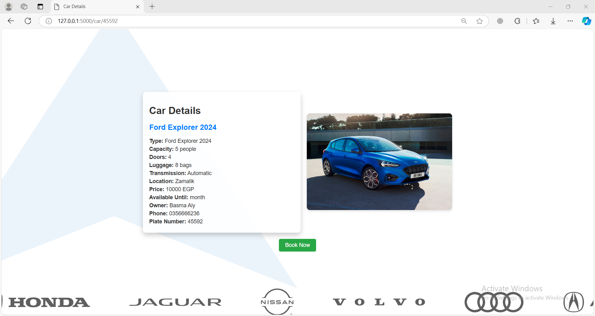

# CarRentalWeb
It's a website that helps you to book cars with a huge variety of models and prices.

## What does it do?
You can book a car or more and cancel the reservation. It also shows their prices and all the car and owner info. The admin can add new cars, remove cars, view the booked list, and cancel bookings.

## New Feature
- A better user profile that contains the cars they booked.
- Deleting a car from the system removes it from the booked list in the user's profile.

## Prerequisites
Make sure you have the following:
**Please make sure to run the project inside the `CarRentalApp` folder.**
- **Python**: Install Python from the official website: [python.org](https://www.python.org)
- **Flask**: Install Flask using pip, Python's package installer. Run the following command:
  ```bash
  pip install Flask


## Project Checklist
-[✔️] It is available on GitHub. (https://github.com/RAImostafa/CarRentalWeb)

-[✔️] It uses the Flask web framework.

-[✔️] It uses at least one module from the Python Standard Library other than the random module.
-Module name: 1-datetime
               2-json
               3-OS

-[✔️] It contains at least one class written by you that has both properties and methods. It uses __init__() to let the class initialize the object's attributes (note that __init__() doesn't count as a method). This includes instantiating the class and using the methods in your app. 
                1- File name for the class definition: car.py and user.py
                2-For the User class in *user.py*:
                    Line number(s) for the class definition: Line 9 
                    Name of two properties: first_name, email
                    Name of two methods: sign_up(), sign_in()
                    File name and line numbers where the methods *are used*:
                    File name: carRental.py
                    Line numbers for sign_up(): Line 20 (inside the /sign_up route).
                    Line numbers for sign_in(): Line 38 (inside the /sign_in route).
                2-For the Car class in *car.py*:
                    File name for the class definition: car.py
                    Line number(s) for the class definition: Line 2
                    Name of two properties: model, car_type
                    Name of two methods: get_cars(), book_car(user, plate_number)
                    File name and line numbers where the methods are used:
                    File name: carRental.py
                    Line numbers for get_cars(): Used in the /home route at line 77, /car/<plate_number> route 122,/admin_page route at line 171.
                    Line numbers for book_car(user, plate_number): Used in the /book_car route at line 142.

-[✔️] It makes use of JavaScript in the front end and uses the localStorage of the web browser.
                1-"localStorage" is used in signup.js at line 3

-[✔️] It uses modern JavaScript (for example, let and const rather than var).
                1-const is used in "profile.js" at line 3,4 
                2-let is used in "home.js" at line 64 ,65

-[✔️] It makes use of the reading and writing to the same file feature.
                cars.txt
                1- in the admin can *ADD* a car by func add_car(form_data, file) at line 113 , in "user.py" 
                2- cars can be *READ* through get_cars() at line 19 , in "car.py"
                3-admin can *DELETE* a car too by func delete_car(plate_number_to_delete) at line 184 , in "user.py" 
                4-admin can *EDIT* a car too by func edit_car(plate_number) at line 230 , in "carRental.py" 

-[✔️] It contains conditional statements.
                 -file name : carRental.py
                 -lines:22,32,40,46,67,....
                 -file name : car.py
                 -lines:22,30,31,43,....
                 -file name : user.py
                 -lines:55,68,72,76,82,103,...

-[✔️] It contains loops. Please provide below the file name and the line number(s) of at least one example of a loop in your code.
                 - File name:carRental.py
                 - Line number(s):72,82,87,102,110,...
                 - File name:user.py
                 - Line number(s):55,77,81,107,143,...
                 - File name:car.py
                 - Line number(s):22,32,43,73,...

-[✔️] It lets the user enter a value in a text box at some point This value is received and processed by your back end Python code.
                - used in Sign in and sign up fileds 
                -Adding car by admin
                -Editing car by admin
                -searching 

-[✔️] It doesn't generate any error message even if the user enters a wrong input.
                 -done through try and catch 

-[✔️] It is styled using your own CSS

-[✔️] The code follows the code and style conventions as introduced in the course, is fully documented using comments and doesn't contain unused 
or experimental code. In particular, the code should not use print() or console.log() for any information the app user should see. Instead, all user feedback needs to be visible in the browser. 

-[✔️] All exercises have been completed as per the requirements and pushed to the respective GitHub repository


## Car Rental Website Screenshots:

### Welcome Page


### Sign-Up Page


### Sign-In Page


### Homepage


### Car Page


### User Profile Page


## Admin Features:

### Admin Page 


### Admin Add Car Page 


### Admin Edit Car Details Page 


### Booked Cars Page 

